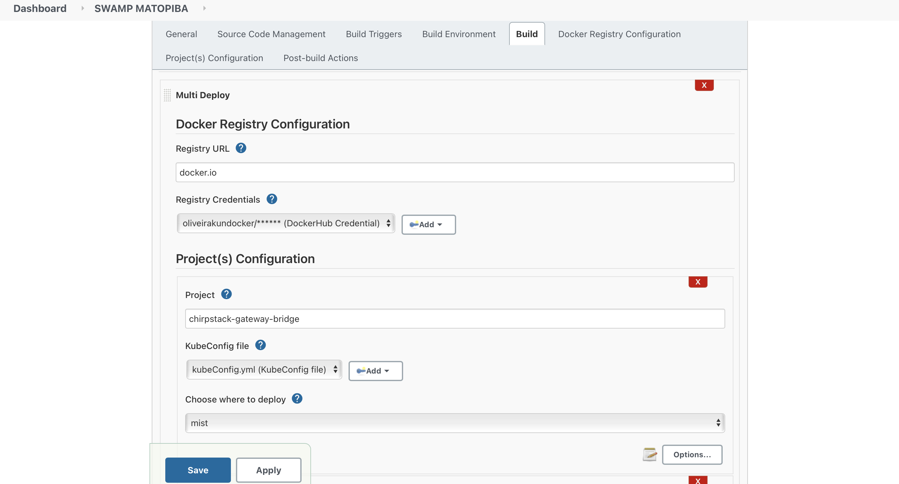

# Multi Deploy Plugin

## Introduction

Multi deploy is a Jenkins plugin that brings DevOps to IoT world, offering the
possibility to deploy applications to cloud, fog or mist. This project was created as part of my masters dissertation. 

## Requirements

- Java 8
- Maven >= 3.8

## Getting started

To run an instance of Jenkins with this plugin installed, execute this command:

``
$ mvn hpi:run 
``

To run unit tests, execute:

``
$ mvn test 
``

To use this plugin, you need first a git repository containing kubernetes manifest files, with all projects separated by directory. You can follow 
the same layout in [swamp-simulator](https://github.com/Oliveirakun/swamp-simulator-manifests) repository.

With this plugin you can configure an application composed by many projects/services and choose where each service will be deployed. You also need to configure a docker registry to store your docker images, before configure the services.
In the image below, you can see an example:

## LICENSE

Licensed under MIT, see [LICENSE](LICENSE.md)

