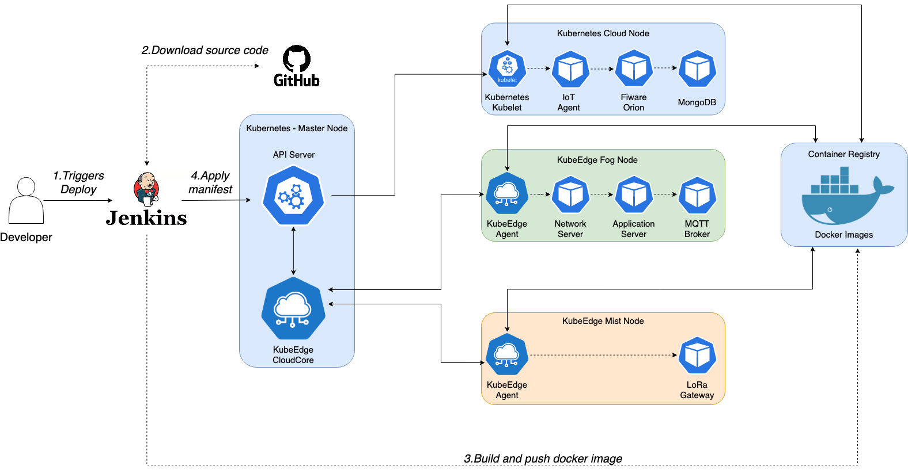
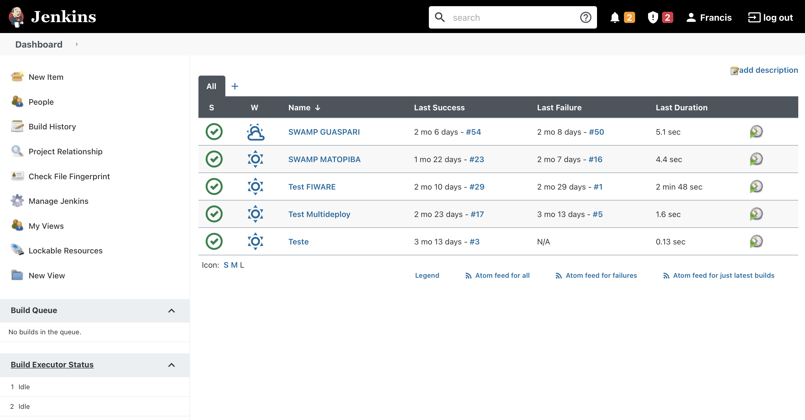

# Multi Deploy Plugin

## Introduction

Multi deploy is a Jenkins plugin that brings DevOps to IoT world, offering the
possibility to deploy applications to cloud, fog or mist. This project was created as part of my master's thesis.

## Requirements

- Java >= 8
- Maven >= 3.8
- Jenkins >= 2.289.1

## Getting started

To run an instance of Jenkins with this plugin installed, execute this command:

``
$ mvn hpi:run 
``

To run unit tests, execute:

``
$ mvn test 
``

To generate a package to deploy on Jenkins, execute:

``
$ mvn install
``

After execute the command above, you may find the file `multideploy.hpi` inside `target` folder. 
Deploy this file on your Jenkins instance.

## How to use

To use this plugin, you need first a git repository containing kubernetes manifest files, with all projects separated by directory. You can follow 
the same layout in [swamp-simulator](https://github.com/Oliveirakun/swamp-simulator-manifests) repository.

With this plugin you can configure an application composed by many projects/services and choose where each service will be deployed.
You also need to configure a docker registry to store your docker images, before configure the services.

## Diagrams

Diagram to illustrate how Jenkins with this plugin was used to deploy [SWAMP](http://swamp-project.org) project:

## Screenshots

#### Dashboard:

   

#### Configuration for MATOPIBA pilot:

## LICENSE

Licensed under MIT, see [LICENSE](LICENSE.md)

